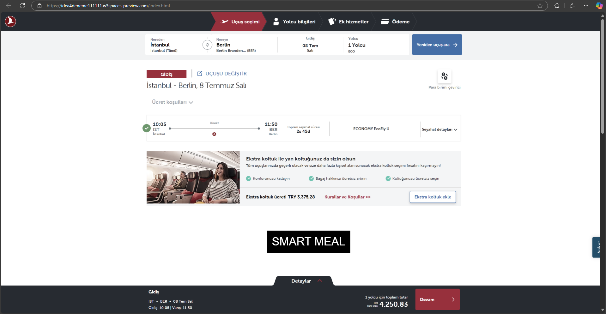
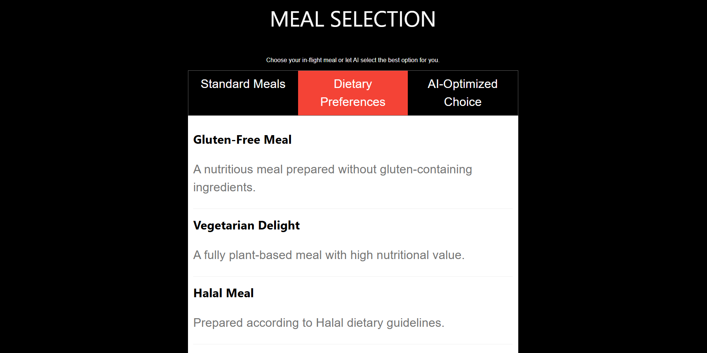
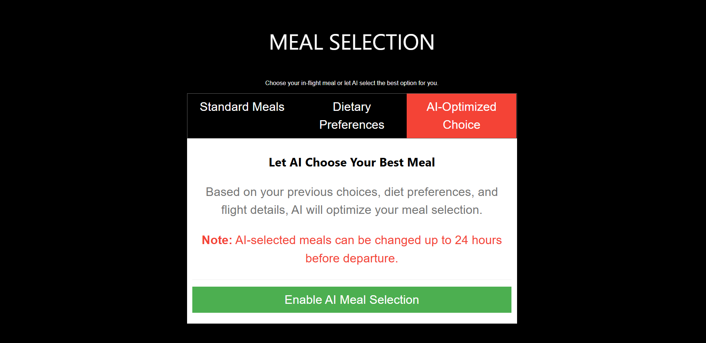

# **Smart Meal Selection - AI-Optimized In-Flight Catering System** 🍽️✈️  

## **📌 Project Overview**  

**Smart Meal Selection** is an **AI-powered in-flight meal optimization system** designed to **reduce food waste, enhance operational efficiency, and improve the passenger experience** for airlines. The system allows passengers to **pre-select their meals** or let AI make the best choice based on their **dietary preferences and past selections**.  

🔹 **This system helps airlines save costs, improve efficiency, and contribute to sustainability by reducing unnecessary meal production.**  

---

## **🚀 Key Features**  
✅ **AI-Powered Meal Selection** – Automatically suggests meals based on passenger preferences.  
✅ **Passenger Pre-Selection** – Travelers can **choose meals while booking tickets or up to 48 hours before departure.**  
✅ **Loyalty Incentives** – Earn **miles/rewards** for pre-selecting meals.  
✅ **Operational Cost Savings** – **Reduces food waste, logistics, and storage costs** for airlines.  
✅ **Faster Cabin Service** – Pre-selected meals **speed up in-flight meal distribution** for cabin crew.  
✅ **Sustainability Focus** – Helps airlines reduce their **carbon footprint** by **minimizing food waste.**  

---

## **📷 Project Screenshots**  

### **1️⃣ Ticket System - Meal Pre-Selection During Booking**  
Passengers can choose their meals during ticket booking, ensuring **better meal planning and reduced waste**.  
  

### **2️⃣ Meal Selection Interface**  
Users can select from **standard meals, dietary preferences, or AI-optimized choices**.  
  

### **3️⃣ AI-Optimized Meal Choice**  
AI suggests the most suitable meal based on **passenger history, diet, and flight details**.  
  

---

## **🛠️ Technologies Used**  
- **Frontend:** HTML, CSS (W3.CSS Framework)  
- **JavaScript:** Interactive UI for meal selection  
- **AI & Data Analytics (Planned in Full Version):** Passenger meal preference prediction  

## 📌 Demo Disclaimer
This is a prototype/demo version of the Smart Meal Selection System. The current functionality is limited to frontend meal selection UI with basic interactions. Backend integration, AI-powered meal prediction, and airline system integration are planned for the final version.

📢 For demo purposes only. Not a final production-ready solution.

##
